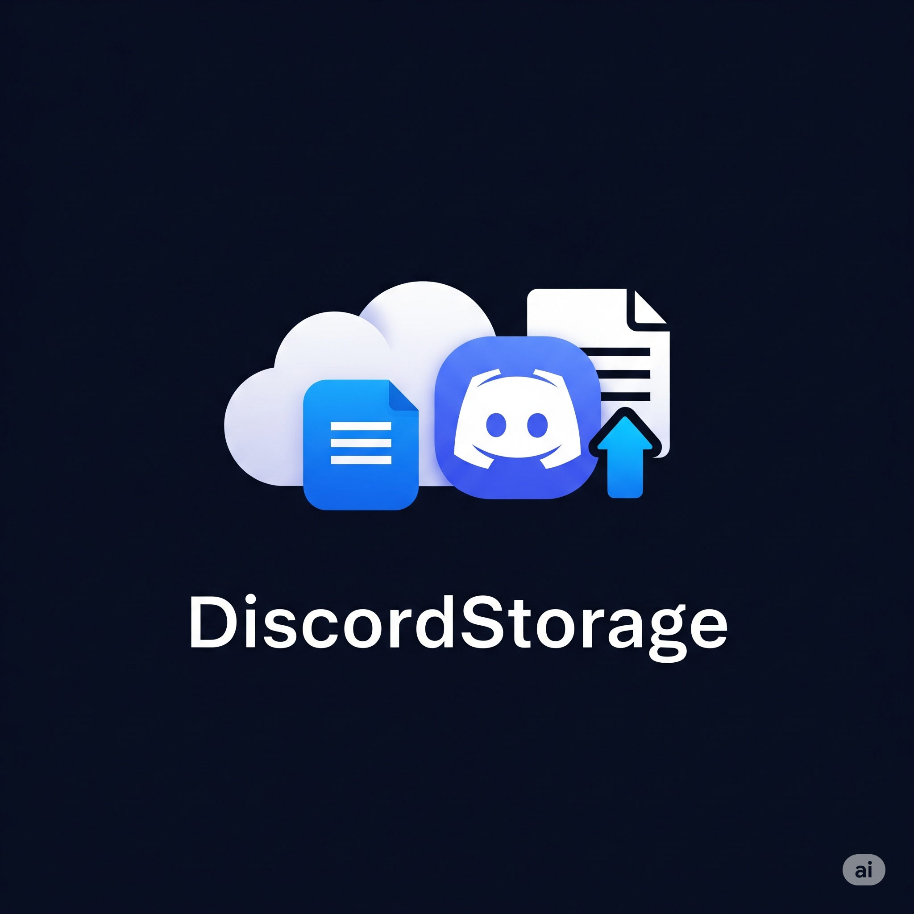

# DiscordStorage

> 📦 Use Discord as your own personal cloud storage  
> ✨ Cross-platform app with Flutter — Android & Windows supported

## ✅ Completed Features

<br clear="left"/>

- 📁 Folder structure support & auto-sync
- 📦 File chunking (10MB max size per part)
- 🔄 File reassembly & restoration
- 🛡 SHA-256 based file integrity verification
- 🧪 `debugLog` support for error tracing
- 🖥️ Flutter-based clean UI (mobile & desktop)
- 🔍 Auto update check system

---

## 🧩 Planned Features (v1.0 Roadmap)

- [ ] 🔧 Fix 403 errors during file downloads by increasing timeout and improving retry logic
- [ ] 🔄 Full auto-sync for all files
- [ ] 🔗 File sharing via unique private links
- [ ] 🛡 Enhanced bot token security (e.g. OS-level encryption)
- [ ] 🔐 File encryption (pre-upload)
- [ ] ☁️ External backup support (Google Drive, IPFS etc.)
- [ ] 📜 Advanced logging & versioning
- [ ] 🕶 Private / hidden folders (locked or passworded)
- [ ] 📂 In-app file previews (PDF, image, text)
- [ ] 📲 Mobile background sync support
- [ ] 🖥️ Pc background sync CLI support
- [ ] 🌐 Web version

---

## 🖥 Installation

### Windows

1. Download from [Releases](https://github.com/KeremKuyucu/DiscordStorage/releases)
2. Run installer and follow steps
3. Launch the app and configure

### Android

1. Get the latest `.apk` from [Releases](https://github.com/KeremKuyucu/DiscordStorage/releases)
2. Install & allow required permissions
3. Open the app and configure

### Developer Setup

```bash
git clone https://github.com/KeremKuyucu/DiscordStorageNew.git
cd DiscordStorageNew
flutter pub get
flutter run
````

---

## ⚙️ Setup Instructions

1. Go to [Discord Developer Portal](https://discord.com/developers/applications) and create a bot
2. Copy the **Bot Token**
3. In-app: Go to **Settings** > Enter:

   * Bot Token
   * Server ID
   * Category ID
4. Save and you're ready

---

## ☁️ How to Use

### Upload a File

* Click **Upload File**
* Choose your file
* App will auto-split & upload

### Download a File

* Tap a listed file
* Click **Download**
* File is auto-restored and saved to Downloads

---

## 🔐 File Integrity

> Uses **SHA-256** checksums to verify both uploaded and downloaded files.

---

## ⚠️ Warnings

> ℹ️ Read these carefully to avoid issues

* ❌ Do **not** manually message in upload channel — it may corrupt the file structure
* ✅ Ensure bot has sufficient permissions in the target category
* 🔒 Prefer giving full permissions in a private category

---

## 👤 Author

> Developed by [**Kerem Kuyucu**](https://github.com/KeremKuyucu)