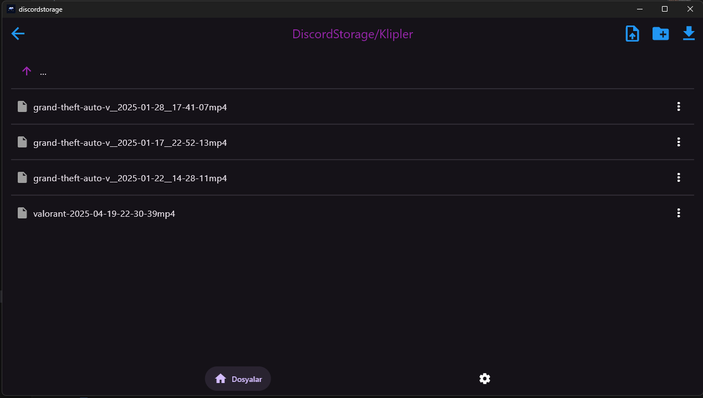

# DiscordStorage

<div align="center">
  
  <p>📦 A file storage and sharing application via Discord</p>
</div>

## 📁 Table of Contents

* [About the Project](#-about-the-project)
* [Features](#-features)
* [Installation](#-installation)
* [Usage](#-usage)
* [Technical Details](#-technical-details)
* [Warnings](#-warnings)
* [Changelog](#-changelog)
* [Contributing](#-contributing)
* [License](#-license)

---

## 🔍 About the Project

<div align="center">
  
</div>

**DiscordStorage** is a cross-platform application that allows you to store your files securely and conveniently using Discord servers. It is developed with **Flutter** and supports both **Android** and **Windows** platforms.

This project is a modernized and improved Flutter version of the [DiscordStorageCpp](https://github.com/keremkuyucu/discordstorageCpp) project previously developed in C++.

---

## 🚀 Features

* 📁 Store and manage files on Discord servers
* 🔐 Bot token is stored only on the local device
* 📄 Automatically splits large files into 8MB parts and uploads them
* 📅 Automatically merges parts and downloads them
* 🧪 `debugLog` support for advanced error tracking
* 🯞 SHA-256 hashing for file integrity verification
* 🖥️ Clean and modern UI compatible with mobile and desktop
* 🔄 Automatic update check system

---

## 💻 Installation

### Windows

1. Download the latest version from the [Releases](https://github.com/KeremKuyucu/DiscordStorage/releases) page.
2. Run the installer and follow the instructions.
3. Once the installation is complete, launch the application.

### Android

1. Download the latest `.apk` file from the [Releases](https://github.com/KeremKuyucu/DiscordStorage/releases) page.
2. Install the APK on your device and grant the necessary permissions.
3. Launch the app.

### For Developers

```bash
# Clone the repository
git clone https://github.com/KeremKuyucu/DiscordStorageNew.git

# Install dependencies
flutter pub get

# Run the application
flutter run
```

---

## 📱 Usage

### Initial Setup

1. Create a bot and get the token from the [Discord Developer Portal](https://discord.com/developers/applications).
2. Go to the **Settings** tab in the app.
3. Enter the bot token and click "Check Token".
4. Enter the Server ID and Category ID.
5. Click "Save" to complete the setup.

### Uploading Files

1. On the main screen, click **"Upload File"**.
2. Select the file you want to upload.
3. The upload will start automatically and the file will appear on the main screen when completed.

### Downloading Files

1. Select the file you want to download on the main screen.
2. Click the **"Download"** button.
3. The file will be automatically downloaded and saved to your device’s **Downloads** folder.

---

## 🔧 Technical Details

### Splitting and Merging

* Due to Discord’s 8MB upload limit, files are split into parts accordingly.
* A JSON record is kept for each part.
* During download, all parts are merged in order.

### File Integrity

* File integrity is verified during upload and download using the **SHA-256** hash algorithm.

---

## ⚠️ Warnings

* **Do not manually send messages to the relevant Discord channel** after a file is uploaded. This may break the system.
* Make sure the bot has all necessary permissions.
* Optionally, you can give full permissions in a private category and restrict the bot in the rest of the server.
* Ensure there is enough free space on your device for large files.

---

## 🤝 Contributing

To contribute:

1. Fork the repository
2. Create a new branch: `git checkout -b new-feature`
3. Commit your changes: `git commit -m "Add new feature"`
4. Push to the branch: `git push origin new-feature`
5. Submit a Pull Request

---

## 📄 License

This project is licensed under the open-source license specified in the [LICENSE](LICENSE) file.

---

<div align="center">
  <p>Developer: <strong>Kerem Kuyucu</strong></p>
  <p>© 2025 DiscordStorage</p>
</div>

---
