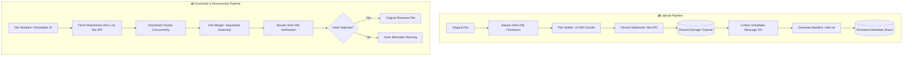

<div align="center">

  

  # DiscordStorage

  **An experimental, high-performance Windows desktop application that turns Discord channels into an encrypted, distributed chunk-based cloud drive.**

  [](https://github.com/KeremKuyucu/DiscordStorage/releases)
  [-0078D4.svg?style=for-the-badge&logo=windows)](https://github.com/KeremKuyucu/DiscordStorage)
  [](https://flutter.dev)
  [](LICENSE)

  <br />

  <p align="center">
    <b>🌐 Language:</b>
    <a href="#-about-the-project"><b>English</b></a> •
    <a href="README.tr.md"><b>Türkçe (TR)</b></a>
  </p>

</div>

---

<p align="center">
  
</p>

---

## 📑 Table of Contents

- [🧠 About the Project](#-about-the-project)
- [🎯 Motivation & Goals](#-motivation--goals)
- [✨ Key Features](#-key-features)
- [🏗️ How It Works (Architecture)](#️-how-it-works-architecture)
- [🔐 Security & Privacy (DPAPI)](#-security--privacy-dpapi)
- [🔗 Custom Protocol & Deep Linking](#-custom-protocol--deep-linking)
- [🚀 Getting Started](#-getting-started)
  - [Prerequisites](#prerequisites)
  - [Discord Bot Configuration](#discord-bot-configuration)
  - [Installation (Installer)](#installation-installer)
- [🛠️ Building from Source](#️-building-from-source)
- [📊 Logging & Diagnostics](#-logging--diagnostics)
- [⚠️ Disclaimer & Discord ToS](#️-disclaimer--discord-tos)
- [🤝 Contributing](#-contributing)
- [📄 License & Author](#-license--author)

---

## 🧠 About the Project

**DiscordStorage** is an open-source, experimental Windows desktop application built with Flutter. It explores the boundaries of unconventional distributed systems by treating Discord server text channels as a decentralized, chunk-based object storage service.

Files uploaded through DiscordStorage are split into ~10 MB binary segments, transmitted through authenticated Discord webhooks and bot APIs, and stored as message attachments across channels. On download, these parts are concurrently retrieved, validated using **streaming SHA-256 checksums**, and seamlessly reassembled into their original form without quality loss.

> [!NOTE]
> Beginning with **v0.5.0-beta**, DiscordStorage shifted from a cross-platform prototype to a **dedicated, optimized Windows desktop application**. Mobile/Android targets have been deprecated to deliver native Windows performance, OS-level credential encryption, custom URL protocol handlers, and silent desktop notifications.

---

## 🎯 Motivation & Goals

DiscordStorage was born as an engineering curiosity and technical exploration. The project aims to:
- **Push platform limits:** Investigate the reliability, resilience, and constraints of using real-time chat infrastructure as an asynchronous storage layer.
- **Design a custom virtual filesystem:** Implement an in-memory virtual directory hierarchy that persists locally and automatically backs itself up to Discord storage shards.
- **Master network edge cases:** Handle Discord API rate limiting (HTTP 429), retries, concurrent multipart uploads, and streaming downloads.
- **Ensure zero-corruption integrity:** Guarantee bit-perfect file assembly via cryptographic streaming hashes, preventing out-of-memory (OOM) errors even on multi-gigabyte files.
- **Build native desktop integration:** Leverage Windows DPAPI via Dart FFI for user-bound token encryption and deep-link protocol handlers.

> *"This project was created because it was technically challenging, educational, and fun to build."*

---

## ✨ Key Features

| Feature | Description |
| :--- | :--- |
| 📁 **Virtual File System** | Create, rename, delete, and organize folders and files hierarchically. Supports local persistence and cloud-backed sync. |
| 🧩 **Smart File Chunking** | Splits large files into ~10 MB parts, bypassing Discord's default attachment upload ceilings. |
| 🛡️ **Streaming SHA-256** | Validates pre-upload and post-assembly file integrity via `openRead` streams without loading full files into RAM (Zero OOM). |
| 🔐 **Windows DPAPI Security** | Bot tokens are encrypted using the Windows Data Protection API (`CryptProtectData`) tied to your Windows user account. Disks store zero plaintext tokens. |
| ⚡ **Real-Time Transfer Metrics** | Live speed indicators (MB/s), visual progress bars, remaining part counters, and estimated time of completion (ETA). |
| 🔔 **Native Windows Notifications** | Powered by `local_notifier` with intelligent throttling and silent progress indicators to eliminate notification spam. |
| 🔗 **Deep Linking Protocol** | Registers the `discordstorage://` protocol in Windows HKCU registry for 1-click downloads via message IDs or links. |
| 🪵 **Interactive Log Streamer** | In-app diagnostic hub with live streaming, log level filtering (Debug/Info/Warn/Error), clipboard copy, and quick Notepad/Explorer access. |
| 🌐 **Bilingual & Themed** | Full Turkish (🇹🇷) and English (🇺🇸) localization with seamless Dark and Light theme switching. |
| 🔄 **Auto-Update Checker** | Notifies you directly in-app when newer releases are published on GitHub. |

---

## 🏗️ How It Works (Architecture)

DiscordStorage abstracts Discord channels into a structured, distributed object store:


```mermaid
flowchart TD
    subgraph Upload ["📤 Upload Pipeline"]
        A[Original File] --> B[Stream SHA-256 Checksum]
        B --> C[File Splitter: 10 MB Chunks]
        C --> D[Discord Webhook / Bot API]
        D --> E[(Discord Storage Channel)]
        E --> F[Collect Snowflake Message IDs]
        F --> G[Generate Manifest .links.txt]
        G --> H[(Persistent Metadata Shard)]
    end

    subgraph Download ["📥 Download & Reassembly Pipeline"]
        I[File Manifest / Snowflake ID] --> J[Fetch Attachment URLs via Bot API]
        J --> K[Download Chunks Concurrently]
        K --> L[File Merger: Sequential Assembly]
        L --> M[Stream SHA-256 Verification]
        M --> N{Hash Matches?}
        N -- Yes --> O[Original Restored File]
        N -- No --> P[Hash Mismatch Warning]
    end
```

### 1. File Chunking & Upload
When a file is uploaded:
1. It is streamed through a SHA-256 hasher to compute a master checksum.
2. The file is divided into ~10 MB slices (`partSize = 10,475,274 bytes`).
3. Each slice is uploaded to a designated Discord channel as an attachment via a dedicated webhook.
4. A manifest (`.links.txt`) is generated recording the total parts, filename, original SHA-256 hash, and chunk message IDs.

### 2. Download & Verification
When a file is requested:
1. The application parses the chunk message IDs from the manifest or shared ID.
2. Fresh attachment URLs are fetched via the Discord Bot API.
3. The parts are sequentially downloaded and merged into the destination file.
4. The assembled file is re-hashed. If the computed hash matches the manifest hash, the download is marked complete; otherwise, an alert is triggered.

---

## 🔐 Security & Privacy (DPAPI)

Unlike simple storage scripts that leave Discord bot tokens in plaintext JSON or config files, DiscordStorage integrates with the **Windows Data Protection API (DPAPI)** using Dart FFI:

- **OS-Bound Encryption:** The bot token is encrypted using `CryptProtectData` with credentials derived from your Windows logon account.
- **Isolated Storage:** The token can only be decrypted on the same computer and under the same Windows user profile.
- **Automatic Migration:** Plaintext tokens from older versions are immediately encrypted with DPAPI upon the first launch.

---

## 🔗 Custom Protocol & Deep Linking

DiscordStorage registers the `discordstorage://` protocol in the Windows Current User Registry (`HKCU\Software\Classes\discordstorage`) during initialization—**no Administrator privileges required**.

### Usage:
- **Protocol URI:** `discordstorage://<MESSAGE_ID>`
- **Command Line:** `discordstorage.exe <MESSAGE_ID>`

When opened via browser or command line with a valid 17–20 digit Discord Snowflake ID, DiscordStorage automatically detects the target file and prompts you to download and reconstruct it immediately.

> [!NOTE]
> The legacy third-party web gateway (`discordStorage-share`) has been deprecated. Shared files are downloaded directly using Discord message IDs or native `discordstorage://` links.

---

## 🚀 Getting Started

### Prerequisites

- **Operating System:** Windows 10 or Windows 11 (64-bit).
- **Discord Account & Server:** An active Discord account and a server where you have administrative access.
- **Discord Bot Token:** A Discord application bot configured on the Developer Portal.

### Discord Bot Configuration

1. Visit the [Discord Developer Portal](https://discord.com/developers/applications) and create a **New Application**.
2. Navigate to the **Bot** tab:
   - Click **Add Bot**.
   - Under **Privileged Gateway Intents**, enable **Message Content Intent**.
   - Click **Reset Token** and copy your **Bot Token**.
3. Navigate to **OAuth2 -> URL Generator**:
   - Check the `bot` scope.
   - Under **Bot Permissions**, select:
     - `Manage Channels`
     - `Manage Webhooks`
     - `Read Messages/View Channels`
     - `Send Messages`
     - `Attach Files`
     - `Read Message History`
   - Copy the generated URL and paste it into your browser to invite the bot to your private Discord server.
4. In your Discord client:
   - Enable **Developer Mode** under *User Settings -> Advanced*.
   - Right-click your server icon -> **Copy Server ID** (`Guild ID`).
   - Create or pick a category for storage, right-click the category -> **Copy Category ID**.
5. Launch **DiscordStorage**, navigate to **Settings**, and paste your **Bot Token**, **Guild ID**, and **Category ID**. The app will automatically validate credentials and provision the necessary storage shard channels.

### Installation (Installer)

1. Head over to the [Releases](https://github.com/KeremKuyucu/DiscordStorage/releases) page.
2. Download the latest installer executable:
   ```
   DiscordStorage_v0.5.0-beta_Installer.exe
   ```
3. Run the installer. It will:
   - Install DiscordStorage into `%LOCALAPPDATA%\DiscordStorage`.
   - Create Desktop and Start Menu shortcuts.
   - Register the `discordstorage://` custom protocol handler.

---

## 🛠️ Building from Source

To compile DiscordStorage from source code on Windows:

### 1. Environment Setup
- Install the [Flutter SDK](https://docs.flutter.dev/get-started/install/windows) (v3.7.2 or later).
- Install [Visual Studio 2022](https://visualstudio.microsoft.com/) with the **"Desktop development with C++"** workload.
- (Optional) Install [Inno Setup 6](https://jrsoftware.org/isdl.php) if you wish to generate the installer.

### 2. Clone & Install Dependencies
```powershell
git clone https://github.com/KeremKuyucu/DiscordStorage.git
cd DiscordStorage
flutter pub get
```

### 3. Run in Debug Mode
```powershell
flutter run -d windows
```

### 4. Build Release Executable
```powershell
flutter build windows --release
```
The compiled binaries will be output to:
`build\windows\x64\runner\Release\`

### 5. Automated Build & Packaging Script
You can use the built-in PowerShell automation scripts:
```powershell
# Quick build
.\build.bat

# Or run the PowerShell build orchestrator
powershell -ExecutionPolicy Bypass -File .\build.ps1
```

---

## 📊 Logging & Diagnostics

DiscordStorage features a dedicated, thread-safe logging pipeline:
- **Log Location:** `%APPDATA%\DiscordStorage\logs\`
- **Viewer Features:**
  - Real-time auto-refreshing log stream (every 3 seconds).
  - Severity level filtering: `DEBUG`, `INFO`, `WARN`, `ERROR`, `VERBOSE`.
  - In-memory search queries.
  - Direct shortcuts to open the active log file in **Notepad** or reveal it in **Windows File Explorer**.
  - One-click log clearing and clipboard copying.

---

## ⚠️ Disclaimer & Discord ToS

> [!CAUTION]
> **Educational & Experimental Purpose Only:**
> - Discord is a chat, voice, and community platform, **not a cloud file storage provider or CDN**.
> - Uploading excessive amounts of data, automated mass file transfers, or bypassing Discord API rate limits may trigger Discord anti-abuse systems and result in **rate-limiting, bot token invalidation, or account suspension**.
> - Do **not** use this software to store mission-critical, sensitive, or irreplaceable data.
> - The author accepts no responsibility for data loss, Discord account sanctions, or violations of [Discord's Terms of Service](https://discord.com/terms).

---

## 🤝 Contributing

Contributions, issues, and feature requests are welcome!

1. **Fork** the repository.
2. Create your feature branch (`git checkout -b feature/AmazingFeature`).
3. Commit your changes (`git commit -m 'feat: Add some AmazingFeature'`).
4. Push to the branch (`git push origin feature/AmazingFeature`).
5. Open a **Pull Request**.

---

## 📄 License & Author

- **Developer:** [Kerem Kuyucu](https://github.com/KeremKuyucu)
- **Contact:** [contact@keremkk.com.tr](mailto:contact@keremkk.com.tr)
- **License:** Distributed under the **GNU General Public License v3.0 (GPL-3.0)**. See [`LICENSE`](LICENSE) for complete terms.

<div align="center">
  <sub>Made with ❤️ in Türkiye • Designed for Windows</sub>
</div>
