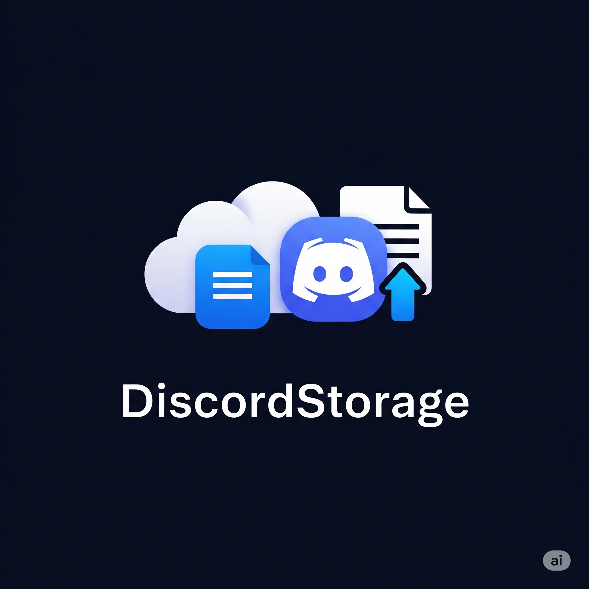
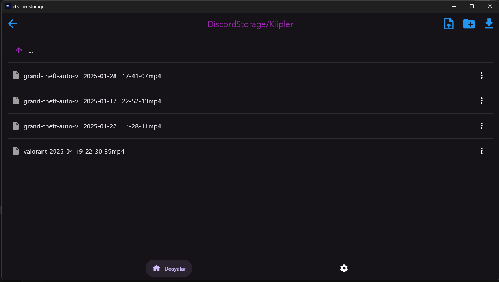

<div align="center">

  

  # DiscordStorage

  **Discord sunucusu kanallarını şifrelenmiş, parçalı ve dağıtık bir bulut sürücüsüne dönüştüren deneysel, yüksek performanslı Windows masaüstü uygulaması.**

  [](https://github.com/KeremKuyucu/DiscordStorage/releases)
  [-0078D4.svg?style=for-the-badge&logo=windows)](https://github.com/KeremKuyucu/DiscordStorage)
  [](https://flutter.dev)
  [](LICENSE)

  <br />

  <p align="center">
    <b>🌐 Dil Seçeneği:</b>
    <a href="README.md"><b>English (EN)</b></a> •
    <a href="#-proje-hakkında"><b>Türkçe</b></a>
  </p>

</div>

---

<p align="center">
  
</p>

---

## 📑 İçindekiler

- [🧠 Proje Hakkında](#-proje-hakkında)
- [🎯 Projenin Amacı & Motivasyon](#-projenin-amacı--motivasyon)
- [✨ Temel Özellikler](#-temel-özellikler)
- [🏗️ Nasıl Çalışır? (Mimari)](#️-nasıl-çalışır-mimari)
- [🔐 Güvenlik ve Gizlilik (Windows DPAPI)](#-güvenlik-ve-gizlilik-windows-dpapi)
- [🔗 Web Paylaşım Portalı ve Derin Bağlantı (`discordstorage://`)](#-web-paylaşım-portalı-ve-derin-bağlantı-discordstorage)
- [🚀 Başlangıç ve Kurulum](#-başlangıç-ve-kurulum)
  - [Gereksinimler](#gereksinimler)
  - [Discord Bot Yapılandırması](#discord-bot-yapılandırması)
  - [Uygulama Kurulumu (Installer)](#uygulama-kurulumu-installer)
- [🛠️ Kaynak Koddan Derleme](#️-kaynak-koddan-derleme)
- [📊 Loglama ve Teşhis Araçları](#-loglama-ve-teşhis-araçları)
- [⚠️ Yasal Uyarı & Discord Hizmet Şartları](#️-yasal-uyarı--discord-hizmet-şartları)
- [🤝 Katkıda Bulunma](#-katkıda-bulunma)
- [📄 Lisans ve İletişim](#-lisans-ve-iletişim)

---

## 🧠 Proje Hakkında

**DiscordStorage**, Flutter altyapısı kullanılarak geliştirilmiş açık kaynaklı ve deneysel bir Windows masaüstü uygulamasıdır. Alışılagelmiş bulut depolama mimarilerinin ötesine geçerek, Discord sunucusu metin kanallarını merkeziyetsiz ve parçalı bir nesne depolama alanına (object storage) dönüştürür.

Yüklenen dosyalar ~10 MB'lık ikili (binary) parçalara bölünür, kimlik doğrulamalı Discord Webhook ve Bot API istekleriyle kanal ekleri olarak depolanır. İndirme aşamasında ise bu parçalar eşzamanlı olarak indirilir, **akış tabanlı SHA-256 doğrulamasından** geçirilir ve veri kaybı olmaksızın asıl dosyaya birleştirilir.

> [!NOTE]
> **v0.5.0-beta** sürümüyle birlikte DiscordStorage, mobil odaklı çok platformlu bir yapıdan **tamamen Windows Masaüstüne odaklı yüksek performanslı bir sisteme** dönüştürülmüştür. İşletim sistemi düzeyinde şifreleme (DPAPI), kayıt defteri protokol kaydı ve yerel masaüstü bildirimleri gibi Windows'a özel yetenekler devreye alınmıştır.

---

## 🎯 Projenin Amacı & Motivasyon

DiscordStorage, teknik bir merak ve mühendislik deneyi olarak hayata geçirildi:
- **Platform sınırlarını zorlamak:** Bir mesajlaşma altyapısının asenkron bir dosya depolama sistemi olarak nasıl davranabileceğini gözlemlemek.
- **Özel bir sanal dosya sistemi tasarlamak:** Klasör hiyerarşisini yerel hafızada tutarken arka planda Discord depolama kanallarına (shard) otomatik yedekleyen bir yapı kurmak.
- **Gerçek dünya ağ limitlerini yönetmek:** Discord API istek sınırları (rate limits - HTTP 429), otomatik yeniden deneme (retry) mekanizmaları ve büyük dosya aktarımlarını tecrübe etmek.
- **Sıfır veri bozulması sağlamak:** Çok gigabaytlık dosyalarda bile bellek taşması (OOM) yaşamadan akış (stream) boru hattıyla tam kriptografik bütünlük kontrolü yapmak.
- **Masaüstü entegrasyonu geliştirmek:** Windows DPAPI ve derin bağlantı protokolleri ile kullanıcı odaklı masaüstü deneyimi inşa etmek.

> *"Bu proje, ticari bir bulut servisine rakip olmak için değil; yapılabildiği ve bunu inşa etmek teknik açıdan son derece keyifli olduğu için geliştirildi."*

---

## ✨ Temel Özellikler

| Özellik | Açıklama |
| :--- | :--- |
| 📁 **Sanal Dosya Sistemi** | İç içe klasörler oluşturun, öğeleri yeniden adlandırın, silin ve sıralayın. Hem yerel hem Discord bulut yedeklemesini destekler. |
| 🧩 **Akıllı Parçalama (Chunking)** | Büyük dosyaları ~10 MB parçalara bölerek Discord'un dosya yükleme sınırlarına takılmadan transfer eder. |
| 🛡️ **Akış Tabanlı SHA-256** | Dosyayı tek seferde RAM'e yüklemeden (`openRead` akışı) hash hesaplar; bellek yetersizliği (OOM) ve kilitlenmeleri önler. |
| 🔐 **Windows DPAPI Şifreleme** | Bot tokeni Windows Veri Koruma API'si (`CryptProtectData`) ile kullanıcı hesabına özel şifrelenir; diskte asla açık metin tutulmaz. |
| ⚡ **Canlı Aktarım İstatistikleri** | Gerçek zamanlı aktarım hızı (MB/s), kalan süre (ETA), parça sayacı ve ilerleme çubuğu. |
| 🔔 **Yerel Windows Bildirimleri** | `local_notifier` ile sessiz ilerleme bildirimleri ve akıllı sınırlama (throttling) sayesinde bildirim kirliliği engellenir. |
| 🔗 **Web Paylaşımı & Derin Bağlantı** | `discordstorage-share` vekil (proxy) web portalı ve `discordstorage://` protokolü ile tek tıkla indirme; uygulama yoksa GitHub'a yönlendirme. |
| 🪵 **Canlı Log Görüntüleyici** | Seviye filtreleme (Debug/Info/Warn/Error), arama kutusu, kopyalama, Not Defteri ve Dosya Gezgini kısayolları. |
| 🌐 **İki Dilli & Temalı Arayüz** | Türkçe ve İngilizce tam yerelleştirme, dinamik Açık/Koyu tema geçişi. |
| 🔄 **Otomatik Güncelleme** | GitHub üzerindeki yeni sürümleri uygulama açılışında otomatik kontrol eder. |

---

## 🏗️ Nasıl Çalışır? (Mimari)

DiscordStorage, Discord metin kanallarını yapılandırılmış bir nesne depolama havuzu gibi yönetir:

```mermaid
flowchart TD
    subgraph Yukleme ["📤 Dosya Yükleme Akışı"]
        A[Orijinal Dosya] --> B[Akış Tabanlı SHA-256 Hash Al]
        B --> C[Dosya Bölücü: 10 MB Parçalar]
        C --> D[Discord Webhook / Bot API]
        D --> E[(Discord Depolama Kanalı)]
        E --> F[Snowflake Mesaj Kimliklerini Topla]
        F --> G[.links.txt Manifest Dosyası Üret]
        G --> H[(Kalıcı Metaveri Shard Kanalı)]
    end

    subgraph Indirme ["📥 Dosya İndirme & Birleştirme Akışı"]
        I[Dosya Manifesti / Snowflake ID] --> J[Bot API ile Parça Bağlantılarını Al]
        J --> K[Parçaları Eşzamanlı İndir]
        K --> L[Dosya Birleştirici: Sıralı Montaj]
        L --> M[Akış SHA-256 Doğrulaması]
        M --> N{Hash Eşleşiyor mu?}
        N -- Evet --> O[Bütünlüğü Tam Dosya]
        N -- Hayır --> P[Hash Uyuşmazlığı Uyarısı]
    end
```



### 1. Parçalama ve Yükleme Süreci
1. Dosya önce SHA-256 akışından geçirilerek ana doğrulama kodu üretilir.
2. Dosya ~10 MB (`10.475.274 bayt`) parçalara bölünür.
3. Her bir parça, ilgili kanala bir Webhook üzerinden dosya eki olarak yüklenir.
4. Parça sayısı, dosya adı, hash değeri ve mesaj kimliklerini içeren bir manifest (`.links.txt`) oluşturulur ve kaydedilir.

### 2. İndirme ve Doğrulama Süreci
1. İndirilmek istenen dosyanın parça mesaj kimlikleri çözülür.
2. Discord Bot API üzerinden güncel dosya indirme bağlantıları (URL) alınır.
3. Parçalar sırayla indirilerek hedef dosyada birleştirilir.
4. Dosya birleştirme sonrası tekrar SHA-256 testine tabi tutulur; eşleşme sağlanırsa işlem onaylanır.

---

## 🔐 Güvenlik ve Gizlilik (Windows DPAPI)

Bot tokenleri düz metin dosyalarında veya güvensiz JSON yapılarında **saklanmaz**:

- **Kullanıcıya Özel Anahtarlama:** Token, Windows Data Protection API (`CryptProtectData`) ile o anki Windows oturum açma kimliğine bağlanarak şifrelenir.
- **İzole Veri Alanı:** Şifrelenmiş token yalnızca aynı bilgisayarda ve aynı Windows kullanıcı profilinde çözülebilir (`CryptUnprotectData`).
- **Otomatik Yükseltme:** Eski sürümlerden kalan düz metin tokenler tespit edildiği anda otomatik olarak DPAPI formatına geçirilir.

---

## 🔗 Web Paylaşım Portalı ve Derin Bağlantı (`discordstorage://`)

DiscordStorage, modern bir web köprüsü (landing page / proxy) ile yerel Windows derin bağlantı (deep linking) sistemini birleştiren pratik ve güvenli bir dosya paylaşım mimarisine sahiptir:

### 🌐 Web Paylaşım Portalı (`discordstorage-share.vercel.app`)
Uygulama içerisinden bir dosyayı paylaştığınızda otomatik olarak `https://discordstorage-share.vercel.app/<MESAJ_ID>` şeklinde bir web bağlantısı üretilir:
- **Vekil (Proxy) Mimarisi:** Web paylaşım sunucusu gigabaytlarca boyuttaki asıl dosyaları kendi sunucularında barındırmaz. Yalnızca dosya adı, SHA-256 doğrulama kodu ve Discord parça bağlantılarını içeren manifesto metnini (`links.txt`) bir vekil (proxy/köprü) olarak taşır. Asıl ikili dosya parçaları Discord CDN üzerinde kalmaya devam eder.
- **Uygulama Yüklüyse:** Ziyaretçi sayfadaki **"DiscordStorage'da Aç"** butonuna bastığında `discordstorage://<MESAJ_ID>` özel protokolü tetiklenir, dosya kimliği güvenlik amacıyla panoya kopyalanır ve masaüstü uygulamasında indirme onay penceresi anında açılır.
- **Uygulama Yüklü Değilse:** Web sayfası ziyaretçiyi doğrudan **GitHub Releases** sayfasına yönlendirerek uygulamayı indirmesini sağlar. Ayrıca dosya kimliğini (ID) tek tıkla kopyalama ve uygulama kurulduğunda indirmeyi tamamlamayı anlatan adım adım bir rehber sunar.

### 🔗 Özel URL Protokolü (`discordstorage://`)
DiscordStorage, açılışta **yönetici yetkisi gerektirmeden** Windows Kullanıcı Kayıt Defteri'ne (`HKCU\Software\Classes\discordstorage`) protokol kaydını yapar.

### Kullanım Biçimleri:
- **Web Portalı Üzerinden:** `discordstorage-share.vercel.app/<MESAJ_ID>` sayfasındaki "DiscordStorage'da Aç" butonuyla
- **Doğrudan Protokol:** `discordstorage://<MESAJ_KIMLIGI>`
- **Komut Satırı:** `discordstorage.exe <MESAJ_KIMLIGI>`
- **Uygulama İçi ID ile:** Üst bardaki **"↓ İndir"** butonuna tıklayıp kopyalanan mesaj kimliğini yapıştırarak

17–20 haneli bir Discord mesaj kimliği tespit edildiğinde uygulama otomatik olarak dosyayı tanır ve kullanıcıya indirme onay penceresini açar.

---

## 🚀 Başlangıç ve Kurulum

### Gereksinimler

- **İşletim Sistemi:** Windows 10 veya Windows 11 (64-bit).
- **Discord Hesabı & Sunucusu:** Yönetici yetkisine sahip olduğunuz bir Discord sunucusu.
- **Discord Bot Tokeni:** Discord Geliştirici Portalı'ndan alınmış bir bot.

### Discord Bot Yapılandırması

1. [Discord Developer Portal](https://discord.com/developers/applications) adresine gidin ve **New Application** butonuna basarak yeni bir uygulama oluşturun.
2. Sol menüden **Bot** sekmesine gelin:
   - **Add Bot** diyerek botu oluşturun.
   - **Privileged Gateway Intents** bölümü altındaki **Message Content Intent** seçeneğini etkinleştirin.
   - **Reset Token** butonuna tıklayarak **Bot Token** bilginizi kopyalayın.
3. **OAuth2 -> URL Generator** sekmesine geçin:
   - `bot` kutucuğunu işaretleyin.
   - **Bot Permissions** listesinden şu izinleri verin:
     - `Manage Channels` (Kanalları Yönet)
     - `Manage Webhooks` (Webhook'ları Yönet)
     - `Read Messages/View Channels` (Mesajları Oku/Kanalları Gör)
     - `Send Messages` (Mesaj Gönder)
     - `Attach Files` (Dosya Ekle)
     - `Read Message History` (Mesaj Geçmişini Oku)
   - Sayfanın altındaki davet bağlantısını tarayıcınızda açarak botu kendi sunucunuza ekleyin.
4. Discord istemcinizde:
   - *Kullanıcı Ayarları -> Gelişmiş* yolunu izleyip **Geliştirici Modu**'nu açın.
   - Sunucu simgenize sağ tıklayıp **Sunucu Kimliğini Kopyala** (`Guild ID`) seçeneğine basın.
   - Depolama kanallarının yerleşeceği bir kategori oluşturup sağ tıklayarak **Kategori Kimliğini Kopyala** (`Category ID`) seçeneğini kullanın.
5. **DiscordStorage** uygulamasını başlatın, **Ayarlar** sekmesine gidin ve aldığınız **Bot Token**, **Sunucu ID** ve **Kategori ID** bilgilerini girip kaydedin. Uygulama depolama kanalını otomatik olarak kuracaktır.

### Uygulama Kurulumu (Installer)

1. [Sürümler (Releases)](https://github.com/KeremKuyucu/DiscordStorage/releases) sayfasına gidin.
2. Güncel kurulum dosyasını indirin:
   ```
   DiscordStorage_v0.5.0-beta_Installer.exe
   ```
3. Kurulum sihirbazını tamamlayın. Kurulum aracı şunları sağlar:
   - Uygulamayı `%LOCALAPPDATA%\DiscordStorage` dizinine yükler.
   - Masaüstü ve Başlat Menüsü kısayollarını ekler.
   - `discordstorage://` protokolünü sisteme tanıtır.

---

## 🛠️ Kaynak Koddan Derleme

Uygulamayı kaynak koddan derlemek için:

### 1. Geliştirme Ortamı
- [Flutter SDK](https://docs.flutter.dev/get-started/install/windows) (v3.7.2 veya üstü).
- [Visual Studio 2022](https://visualstudio.microsoft.com/) ("C++ ile masaüstü geliştirme" iş yükü seçili olmalıdır).
- (İsteğe bağlı) Kurulum paketi derlemek için [Inno Setup 6](https://jrsoftware.org/isdl.php).

### 2. Projeyi Klonlama ve Paketleri Alma
```powershell
git clone https://github.com/KeremKuyucu/DiscordStorage.git
cd DiscordStorage
flutter pub get
```

### 3. Hata Ayıklama Modunda Çalıştırma
```powershell
flutter run -d windows
```

### 4. Release Masaüstü Derlemesi
```powershell
flutter build windows --release
```
Derlenen dosyalar şu dizinde oluşur:
`build\windows\x64\runner\Release\`

### 5. Otomatik CI/CD Sürüm Dağıtımı
Proje, GitHub Actions (`.github/workflows/release.yml`) ile tam otomatik çalışmaktadır. Yeni bir sürüm etiketi (`v*`) push edildiğinde Windows installer otomatik olarak derlenir, Inno Setup ile paketlenir, imzalanır ve GitHub Releases üzerinde yayınlanır.

---

## 📊 Loglama ve Teşhis Araçları

- **Log Dosya Konumu:** `%APPDATA%\DiscordStorage\logs\`
- **Özellikler:**
  - 3 saniyede bir otomatik güncellenen canlı akış penceresi.
  - Seviye bazlı filtreleme: `DEBUG`, `INFO`, `WARN`, `ERROR`, `VERBOSE`.
  - Anlık metin arama filtresi.
  - Doğrudan **Not Defteri** ile açma veya **Windows Dosya Gezgini**'nde gösterme.
  - Tek tıkla panoya kopyalama ve log temizleme.

---

## ⚠️ Yasal Uyarı & Discord Hizmet Şartları

> [!CAUTION]
> **Yalnızca Eğitim ve Deney Amaçlıdır:**
> - Discord bir topluluk ve sesli iletişim platformudur; **ticari bir bulut depolama veya CDN sağlayıcısı değildir**.
> - Aşırı miktarda veri transferi, otomatik seri yüklemeler veya API istek sınırlarının aşılması Discord koruma filtrelerini tetikleyebilir ve **bot tokeninizin iptaline ya da hesabınızın askıya alınmasına** yol açabilir.
> - Bu yazılımı kritik, hassas veya yedeksiz verileriniz için **kullanmayınız**.
> - Oluşabilecek veri kayıplarından veya [Discord Hizmet Şartları](https://discord.com/terms) yaptırımlarından yazılımın geliştiricisi sorumlu tutulamaz.

---

## 🤝 Katkıda Bulunma

Hata bildirimleri, fikirler ve çekme istekleri (Pull Request) memnuniyetle karşılanır:

1. Projeyi çatallayın (**Fork**).
2. Özellik dalınızı oluşturun (`git checkout -b feature/YeniOzellik`).
3. Değişikliklerinizi kaydedin (`git commit -m 'feat: Yeni özellik eklendi'`).
4. Dalınıza gönderin (`git push origin feature/YeniOzellik`).
5. Bir **Pull Request** açın.

---

## 📄 Lisans ve İletişim

- **Geliştirici:** [Kerem Kuyucu](https://github.com/KeremKuyucu)
- **E-Posta:** [contact@keremkk.com.tr](mailto:contact@keremkk.com.tr)
- **Lisans:** Bu proje **GNU General Public License v3.0 (GPL-3.0)** ile korunmaktadır. Ayrıntılar için [`LICENSE`](LICENSE) dosyasını inceleyebilirsiniz.

<div align="center">
  <sub>Made with ❤️ in Türkiye</sub>
</div>
